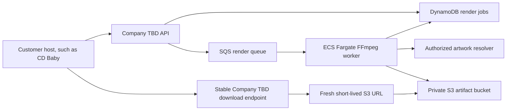

# AWS architecture path

AWS is the first production-cloud target for Company TBD, but it is an adapter rather than part of the motion domain. The editor and renderer ask small interfaces to save jobs and artifacts. Localhost implements those interfaces with in-memory adapters; AWS implementations can use DynamoDB and S3 without changing React, PixiJS, effect math, or the render contract.

## Recommended production shape



### Why these services

- **Amazon S3** stores rendered GIF and MP4 bytes. The bucket stays private. A backend endpoint creates a short-lived presigned download only when the artist asks for the file; the signed URL is never the durable project identifier. AWS documents that presigned URLs provide time-limited object access and expire no later than the credentials that created them: [S3 presigned URLs](https://docs.aws.amazon.com/AmazonS3/latest/userguide/using-presigned-url.html).
- **Amazon DynamoDB** stores the `RenderJob`, its versioned request, status, and durable S3 object key. Optional TTL can clean up temporary job records, but deletion is asynchronous and must not be used as an exact scheduling mechanism: [DynamoDB TTL](https://docs.aws.amazon.com/amazondynamodb/latest/developerguide/TTL.html).
- **Amazon SQS** decouples checkout from rendering and permits retry after a crashed worker. Standard queues use at-least-once delivery, so rendering and storage must be idempotent. The worker extends visibility for long renders and deletes the message only after the job and files are saved: [SQS visibility timeout](https://docs.aws.amazon.com/AWSSimpleQueueService/latest/SQSDeveloperGuide/sqs-visibility-timeout.html).
- **Amazon ECS on Fargate** runs the containerized FFmpeg worker without managing EC2 servers. Video rendering has variable CPU, memory, runtime, and native binary requirements, which fit a container worker more naturally than putting FFmpeg in the request API.
- **AWS CDK v2 in TypeScript** defines buckets, queues, tables, roles, alarms, and container services as reviewed code. TypeScript is a stable, fully supported CDK language: [CDK with TypeScript](https://docs.aws.amazon.com/cdk/v2/guide/work-with-cdk-typescript.html).

The first AWS version does not need CloudFront, multiple regions, Kubernetes, or microservices. Those would add cost and concepts before usage proves they solve a real problem.

## Boundaries already in the code

- `RenderJobRepository` creates, finds, and revision-checks updates to a job plus its versioned render request. `InMemoryRenderJobRepository` keeps localhost fast, while `DynamoDbRenderJobRepository` implements the same cloud-neutral contract in AWS.
- `DynamoDbRenderJobRepository` uses a conditional create to reject duplicate IDs and a conditional update to reject stale revisions. It validates records read from AWS before returning domain objects and refreshes the table's seven-day `expiresAt` TTL whenever active work is saved.
- `RenderArtifactStore` saves and retrieves a rendered artifact by job ID and filename. `InMemoryRenderArtifactStore` is the localhost adapter, and the S3 adapter implements the same contract for AWS.
- `S3RenderArtifactStore` is the first AWS adapter. It stores bytes and required render metadata under `previews/{encoded-job-id}/{encoded-file-name}` using the AWS SDK's normal credential chain. A missing object returns `undefined`; authorization and service errors remain visible instead of being mistaken for missing files.
- `LocalFileRenderService` coordinates rendering through those interfaces. It no longer owns job or artifact `Map`s.
- The client receives a stable Company TBD download route. A future AWS route can authorize the user and redirect to a newly generated S3 presigned URL without storing that temporary URL in the job.

The conditional DynamoDB writes prevent two workers from silently overwriting one another because two SQS deliveries may race. A deterministic object key makes repeating the same completed artifact write safe. The future worker should treat a revision conflict as evidence that another worker has already advanced the job. Failed messages should eventually move to a dead-letter queue for inspection.

## Incremental learning plan

1. **Account safety:** the CLI uses temporary console-login credentials, development is isolated in `us-west-2`, and a USD 10 monthly Budget alerts at 80% actual usage. No permanent AWS access key belongs in this repository or browser code. Root MFA remains a required manual account setting and must be checked in the console.
2. **Infrastructure tests and deployment:** complete. The CDK assertions cover the private encrypted S3 bucket, lifecycle rules, DynamoDB table, SQS render queue, dead-letter queue, and budget. The development stack is deployed and its live safeguards have been verified through read-only AWS API calls.
3. **S3 adapter:** private object read/write is implemented, unit tested, and verified against the real development bucket with an opt-in round-trip integration test. Just-in-time presigned downloads remain future work.
4. **DynamoDB adapter:** complete. The versioned repository is covered by fast unit tests and a live create/read/update/conflict/delete integration test. Conditional writes prevent stale workers from replacing newer job state.
5. **Worker:** package the existing Node/FFmpeg renderer in a Docker image, then run it as a Fargate worker consuming job IDs from SQS.
6. **Observability and cleanup:** add CloudWatch logs and alarms, including a dead-letter queue alarm. S3 lifecycle expiration and DynamoDB TTL are already configured for temporary data.

Each phase keeps the in-memory adapter for fast tests. AWS integration tests supplement the unit suite; they do not replace it.

## Current development deployment

The AWS account is on the active free plan. The project deliberately did not enable AWS Organizations or the default multi-Region IAM Identity Center configuration because doing so would have ended the account's free plan and created a customer-managed KMS key. AWS CLI 2.32 and later instead supports short-lived credentials from the existing console session through [`aws login`](https://docs.aws.amazon.com/cli/latest/userguide/cli-configure-sign-in.html).

The named `motionart-bootstrap` profile uses that temporary login provider and defaults to `us-west-2`. It was used for initial bootstrapping and deployment; it is not a permanent access key and expires automatically. Root credentials remain inappropriate for ordinary ongoing development. Before the service handles real customer data or adds collaborators, replace this bootstrap-only access with a dedicated least-privilege federated development identity.

On August 20, 2026:

1. `CDKToolkit` bootstrap version 32 was deployed in `us-west-2` with termination protection.
2. `MotionArtDevelopment` was deployed with a private S3 artifact bucket, on-demand DynamoDB table, encrypted SQS render queue and dead-letter queue, and the cost budget.
3. Live API checks confirmed public S3 access is fully blocked, AES-256 encryption is enabled, `previews/` expires after seven days, incomplete multipart uploads abort after one day, DynamoDB TTL uses `expiresAt`, and SQS sends a job to the dead-letter queue after three receives.
4. The opt-in S3 integration test uploaded four bytes through `S3RenderArtifactStore`, read back the complete domain artifact, and deleted the test object. The bucket was empty after cleanup.
5. The opt-in DynamoDB integration test created a versioned job, read it consistently, advanced it with a conditional update, proved a stale revision was rejected, and deleted the exact test item. The table was empty after cleanup.

Run the integration test only against an explicitly selected development bucket:

```bash
AWS_PROFILE=motionart-bootstrap \
AWS_REGION=us-west-2 \
MOTION_ART_ARTIFACT_BUCKET=<ArtifactBucketName output> \
npm run test:aws:s3
```

Run the DynamoDB integration test only against an explicitly selected development table:

```bash
AWS_PROFILE=motionart-bootstrap \
AWS_REGION=us-west-2 \
MOTION_ART_RENDER_JOB_TABLE=<RenderJobTableName output> \
npm run test:aws:dynamodb
```

Ordinary `npm test` skips both AWS integration suites. They supplement the fast unit tests at the cloud boundary instead of replacing them.

The stack creates a USD 10 monthly budget with an email alert at 80% actual spend. A budget alert is a warning, not a hard spending cap; AWS can continue creating charges after the threshold is crossed.

The current stack retains its S3 bucket and DynamoDB table if the CloudFormation stack is deleted, protecting stored customer work from an accidental `cdk destroy`. Temporary objects under `previews/` expire after seven days. Active job records receive a seven-day `expiresAt` value on each write; DynamoDB removes expired records asynchronously. The two queues can be safely recreated and are removed with the stack.

## Tooling security note

The CDK packages are exact development-only versions so upgrades are intentional. At the time this stack was created, the current `aws-cdk-lib` release bundles `brace-expansion` 5.0.8 and npm reports [GHSA-rgw5-rvv9-x895](https://github.com/advisories/GHSA-rgw5-rvv9-x895). The patched 5.0.9 cannot be substituted because AWS bundles that dependency inside the library. `npm audit --omit=dev` reports zero production vulnerabilities, and the CDK only processes our trusted infrastructure source. Upgrade `aws-cdk-lib` as soon as AWS republishes with the patched bundle.
