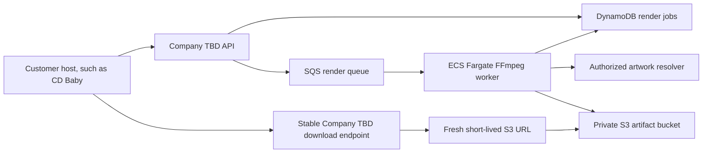

# AWS architecture path

AWS is the first production-cloud target for Company TBD, but it is an adapter rather than part of the motion domain. The editor and renderer ask small interfaces to save jobs and artifacts. Localhost implements those interfaces with in-memory adapters; AWS implementations can use DynamoDB and S3 without changing React, PixiJS, effect math, or the render contract.

## Recommended production shape

### Why these services

- **Amazon S3** stores rendered GIF and MP4 bytes. The bucket stays private. A backend endpoint creates a short-lived presigned download only when the artist asks for the file; the signed URL is never the durable project identifier. AWS documents that presigned URLs provide time-limited object access and expire no later than the credentials that created them: [S3 presigned URLs](https://docs.aws.amazon.com/AmazonS3/latest/userguide/using-presigned-url.html).
- **Amazon DynamoDB** stores the `RenderJob`, its versioned request, status, and durable S3 object key. Optional TTL can clean up temporary job records, but deletion is asynchronous and must not be used as an exact scheduling mechanism: [DynamoDB TTL](https://docs.aws.amazon.com/amazondynamodb/latest/developerguide/TTL.html).
- **Amazon SQS** decouples checkout from rendering and permits retry after a crashed worker. Standard queues use at-least-once delivery, so rendering and storage must be idempotent. The worker extends visibility for long renders and deletes the message only after the job and files are saved: [SQS visibility timeout](https://docs.aws.amazon.com/AWSSimpleQueueService/latest/SQSDeveloperGuide/sqs-visibility-timeout.html).
- **Amazon ECS on Fargate** runs the containerized FFmpeg worker without managing EC2 servers. Video rendering has variable CPU, memory, runtime, and native binary requirements, which fit a container worker more naturally than putting FFmpeg in the request API.
- **AWS CDK v2 in TypeScript** defines buckets, queues, tables, roles, alarms, and container services as reviewed code. TypeScript is a stable, fully supported CDK language: [CDK with TypeScript](https://docs.aws.amazon.com/cdk/v2/guide/work-with-cdk-typescript.html).

The first AWS version does not need CloudFront, multiple regions, Kubernetes, or microservices. Those would add cost and concepts before usage proves they solve a real problem.

## Boundaries already in the code

- `RenderJobRepository` saves and finds the job plus its versioned render request. `InMemoryRenderJobRepository` is the localhost adapter; a DynamoDB adapter will implement the same two asynchronous methods.
- `RenderArtifactStore` saves and retrieves a rendered artifact by job ID and filename. `InMemoryRenderArtifactStore` is the localhost adapter; an S3 adapter will store the bytes under a deterministic private object key.
- `LocalFileRenderService` coordinates rendering through those interfaces. It no longer owns job or artifact `Map`s.
- The client receives a stable Company TBD download route. A future AWS route can authorize the user and redirect to a newly generated S3 presigned URL without storing that temporary URL in the job.

Production adapters will need conditional DynamoDB writes and idempotency checks because two SQS deliveries may race. A deterministic object key makes repeating the same completed artifact write safe. Failed messages should eventually move to a dead-letter queue for inspection.

## Incremental learning plan

1. **Account safety:** enable multi-factor authentication, use IAM Identity Center or another temporary-credential flow, choose one development region, and create a small AWS Budget alert. Never put an AWS access key in this repository or browser code.
2. **Infrastructure tests:** add an `infra/` TypeScript CDK app and write assertions for a private encrypted S3 bucket, lifecycle rules, a DynamoDB table, an SQS queue, and a dead-letter queue. `cdk synth` is safe local feedback; deployment comes later.
3. **S3 adapter:** implement `RenderArtifactStore` with the AWS SDK and test it against its interface. Add just-in-time presigned downloads.
4. **DynamoDB adapter:** implement `RenderJobRepository` with conditional updates so job state cannot move backward or be completed twice.
5. **Worker:** package the existing Node/FFmpeg renderer in a Docker image, then run it as a Fargate worker consuming job IDs from SQS.
6. **Observability and cleanup:** add CloudWatch logs and alarms, S3 lifecycle expiration, DynamoDB TTL for temporary records, and a dead-letter queue alarm.

Each phase keeps the in-memory adapter for fast tests. AWS integration tests supplement the unit suite; they do not replace it.

## Current account checkpoint

**An AWS account is not required yet.** `npm run infra:test` and `npm run infra:synth` run locally and create no cloud resources. Do not run `cdk bootstrap` or `cdk deploy` yet.

The account becomes necessary immediately before the first AWS integration deployment. Before that command, we will stop and complete this checklist together:

1. Create the AWS account and enable root-user multi-factor authentication.
2. Configure daily access through IAM Identity Center or another temporary-credential flow rather than root or permanent browser credentials.
3. Choose one development region and the email address for cost alerts.
4. Verify the identity with `aws sts get-caller-identity`.
5. Bootstrap that account/region with termination protection. AWS explains that bootstrapping creates deployment resources and is required before the first CDK deployment: [CDK bootstrapping](https://docs.aws.amazon.com/cdk/v2/guide/bootstrapping.html).
6. Review the synthesized template and deploy with the required `BudgetAlertEmail` parameter.

The current stack retains its S3 bucket and DynamoDB table if the CloudFormation stack is deleted, protecting stored customer work from an accidental `cdk destroy`. Temporary objects under `previews/` expire after seven days. The two queues can be safely recreated and are removed with the stack.

## Tooling security note

The CDK packages are exact development-only versions so upgrades are intentional. At the time this stack was created, the current `aws-cdk-lib` release bundles `brace-expansion` 5.0.8 and npm reports [GHSA-rgw5-rvv9-x895](https://github.com/advisories/GHSA-rgw5-rvv9-x895). The patched 5.0.9 cannot be substituted because AWS bundles that dependency inside the library. `npm audit --omit=dev` reports zero production vulnerabilities, and the CDK only processes our trusted infrastructure source. Upgrade `aws-cdk-lib` as soon as AWS republishes with the patched bundle.
